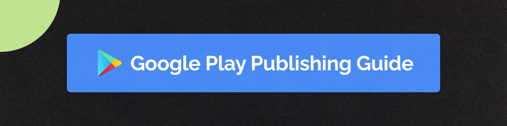

## Google Play Publishing Guide 

### Publish Your App Hassle-Free: A Step-by-Step Guide to Google Play Deployment 🚀

 

 

# 📝 Features:

- Step-by-Step Guide to publish an application in Google Play Store ✅
- How to create an application in Google Play Console 🛠
- How to configure store settings information ⚙️
- How to provide store listing information 📝
- Common errors while publishing an application & how to fix them 🚨

# 📦 Made with

- [Docusaurus](https://docusaurus.io/)
- [Vercel](https://vercel.com)

# 🔗 Connect with me

 

# 🤝 Contribution

Contributions are welcome! If you have suggestions, improvements, or bug fixes, please open an issue
or submit a pull request.

1. Fork the repository.
2. Create a new branch (feature-branch)
3. Commit your changes.
4. Push to the branch and submit a pull request.

# 📬 Contact

For issues or suggestions, open an issue or reach out at avniprajapati21101@gamil.com.